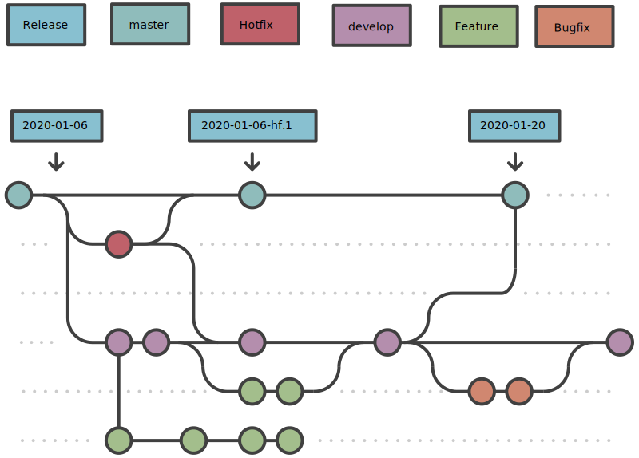

# Git

We use most parts of [Git flow](https://www.atlassian.com/git/tutorials/comparing-workflows/gitflow-workflow). 
Below you will find the crucial parts that we use.

* Every project **MUST** have a `master` and `dev` branch and use git tags for production releases.
* The `release` branch is omitted - instead we use the `master` branch.

## Releases

* Every production deployment **MUST** be based on a git tag and not any branch.
* They **MUST** be named by the following pattern: `{year}-{month}-{day}[-hf.{number}]`
* There **SHOULD** be only a single release/deployment per day - except hotfix releases.

## Branches

* All branches **MUST** be named in `lower-kebab-case` and are allowed to contain a single slash `/` to divide the branch type.
* They **SHOULD** be named by the following pattern: `{type}/[{issue-number}-]{short-description}`

## master Branch

* The `master` branch **MUST NOT** be deployed directly and is therefor not connected to any server instance.
* The `master` branch **MUST** be tagged before any production deployment.

### Hotfixes

* Hotfixes are fixes for bugs which can't wait for the next regular release and have to be fixed immediately.
* Hotfixes **MUST** relate to any existing issue that only contains the task to fix this bug on production.
* They **MUST** be named by the following pattern: `hotfix/{issue-number}-{short-description}`
* They **MUST** be based on the `master` branch.
* They **MUST** be merged into the `master` branch.
* They **MUST** be released as a Hotfix release of the last regular release as soon as they are merged.

## dev Branch

* The `dev` branch **SHOULD** be related to the dev/staging server instance and **SHOULD** be continuously deployed.
* The `dev` branch is the base branch for all features and bugfixes.

### Features

* Features are implementations of user-stories that introduce new or enhance existing functionalities.
* They **MUST** be named by the following pattern: `feature/[{issue-number}-]{short-description}`
* They **MUST** be based on the `dev` branch.
* They **MUST** be merged into the `dev` branch.
* They **MUST** be released during the regular release cycle.

### Bugfixes

* Bugfixes are fixes for bugs that do not prevent the current production system from working and can be fixed/released during the regular release cycle.
* They **MUST** be named by the following pattern: `bugfix/[{issue-number}-]{short-description}`
* They **MUST** be based on the `dev` branch.
* They **MUST** be merged into the `dev` branch.
* They **MUST** be released during the regular release cycle.
